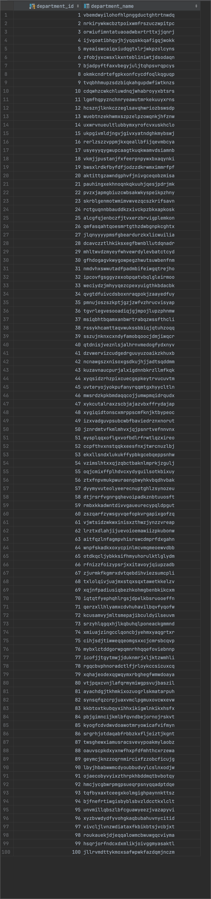

# Data Wow Entrance Exam

## Table of Contents
1. [Overview](#overview)
2. [Getting Start](#getting-start)
3. [Architecture](#architecture)
4. [Test the Solution](#test-the-solution)
5. [Contribution & Feedback](#contribution--feedback)

## Overview 
1. **Objective**: To create a data pipeline that generates data using the `sampledata.py` script and loads this data into a PostgreSQL database.
2. **Technologies Used**: The pipeline will be orchestrated using Airflow, Mage.ai, Kubeflow, and MLflow and will be containerized using Docker.
3. **Time Frame**: You have 4 days to complete the test.
4. **Deliverables**: 
   - Docker Compose configuration
   - A usable data pipeline (finish within 30 min)
   - Video recording showcasing testing and functionality
   - A database design diagram
   - A comprehensive Readme file

## Getting Start

### Prerequisites
- Docker & Docker Compose
- Python 3.8 or above

### Data Preparation
To generate the sample data:

```shell
pip install -r requirements.txt
python sampledata_new.py
```

This will generate data in the data_sample folder.

### Docker Setup (Docker Compose)
To run the pipeline, we will use Docker Compose to orchestrate the containers. The `docker-compose.yml` file contains the configuration for the containers. 

```shell
docker-compose up -d
```

which will start the containers in the background.


docker-compose file contains the following services:

| Service           | Description                                         |
|-------------------|-----------------------------------------------------|
| `postgres`         | PostgreSQL database   & Apache Airflow database     |
| `spark`            | Apache Spark                                        |
| `spark`-worker     | Apache Spark worker which in this compose contain 3 |
| `airflow-webserver` | Apache Airflow  webserver                           |
| `airflow-scheduler` | Apache Airflow scheduler                            |
| `airflow-worker`   | Apache Airflow worker                               |
| `airflow-init`     | Apache Airflow init                                 |

To access Airflow Webserver, go to `http://localhost:8080` and login with the following credentials:
user: `airflow`
password: `airflow`

Then you will see the following UI:


Go to Admin -> Connections and create a new connection with the following details:


You have to add 2 connections for the database and the spark cluster.

First connection is for the database:

| Field           | Value                                    |
|-------------------|------------------------------------------|
| Conn Id         | `postgres_default`                       |
| Conn Type            | `Postgres`                               |
| Host     | value from `ifconfig en0 \| grep 'inet ' | awk '{print $2}'` |
| Schema   | `warehouse`                              |
| Login   | `datawow`                                |
| Password   | `dataengineer`                           |
| Port   | `5432`                                   |

Second, connection is for the spark cluster:

| Field           | Value           |
|-------------------|-----------------|
| Conn Id         | `spark_default` |
| Conn Type            | `Spark`         |
| Host     | `spark://spark`     |
| Port   | `7077`          |
| Extra   | `{"queue": "root.default"}` |

The connection setting should look like this:


to stop the containers:

```shell
docker-compose down
```

Note: The `docker-compose.yml` file is located in the `docker` folder.


### Database Design Diagram


With this design, the generated data from the script can be stored effectively, ensuring data integrity and optimizing for query performance. The normalization ensures that the data remains consistent and reduces redundancy. 

I store the DDL inside the file `create_table.sql` inside the `init-script` folder.

```sql
-- Creating sequences
CREATE SEQUENCE department_department_id_seq;
CREATE SEQUENCE sensor_sensor_id_seq;
CREATE SEQUENCE product_product_id_seq;
CREATE SEQUENCE datalog_log_id_seq;

-- Table: department
CREATE TABLE IF NOT EXISTS "department" (
  "department_id" BIGINT DEFAULT nextval('department_department_id_seq') PRIMARY KEY,
  "department_name" VARCHAR(255) UNIQUE
  -- "load_date" DATE
);

-- Table: sensor
CREATE TABLE IF NOT EXISTS "sensor" (
  "sensor_id" BIGINT DEFAULT nextval('sensor_sensor_id_seq') PRIMARY KEY,
  "sensor_serial" VARCHAR(255) UNIQUE,
  "department_id" BIGINT
  -- "load_date" DATE
);

-- Table: product
CREATE TABLE IF NOT EXISTS "product" (
  "product_id" BIGINT DEFAULT nextval('product_product_id_seq') PRIMARY KEY,
  "product_name" VARCHAR(255) UNIQUE
  -- "load_date" DATE
);

-- Table: datalog
CREATE TABLE IF NOT EXISTS "datalog" (
  "log_id" BIGINT DEFAULT nextval('datalog_log_id_seq') PRIMARY KEY,
  "create_at" TIMESTAMP,
  "product_id" BIGINT,
  "sensor_id" BIGINT,
  "product_expire" TIMESTAMP
  -- "load_date" DATE
);

-- Setting ownership of sequences
ALTER SEQUENCE department_department_id_seq OWNED BY "department"."department_id";
ALTER SEQUENCE sensor_sensor_id_seq OWNED BY "sensor"."sensor_id";
ALTER SEQUENCE product_product_id_seq OWNED BY "product"."product_id";
ALTER SEQUENCE datalog_log_id_seq OWNED BY "datalog"."log_id";

-- Adding Foreign Key Constraints
ALTER TABLE "sensor" ADD FOREIGN KEY ("department_id") REFERENCES "department" ("department_id");
ALTER TABLE "datalog" ADD FOREIGN KEY ("product_id") REFERENCES "product" ("product_id");
ALTER TABLE "datalog" ADD FOREIGN KEY ("sensor_id") REFERENCES "sensor" ("sensor_id");

```

## Architecture

### Apache Airflow


### Project Architecture


## Monitoring on Apache Airflow


If you want to see each task's log, you can click on the task and click on the log tab.


## Test the Solution
A video demonstrating the entire pipeline, from data generation to data ingestion into PostgreSQL, has been provided. The video showcases:

1. [Pipeline initiation and monitoring](https://1drv.ms/f/s!ArqUMDU_R-ndg9l0MMeY5aon-heD4w?e=8jmMaM)
2. [Data validation in the PostgreSQL database](https://1drv.ms/f/s!ArqUMDU_R-ndg9l52GeZCIK3epfkbA?e=Bbocb3)


In case you don't want to see the video you can see the screenshot below.

| Table           | Result                                        | 
|-------------------|-----------------------------------------------------|
| `department`         |         |
| `sensor`            |                      |
| `product`     |            |
| `datalog`   |            |

which each table has the following data:

| Table           | Total Record |
|-------------------|--------------|
| `department`         | 100          |
| `sensor`            | 1876         |
| `product`     | 1000         |
| `datalog`   | 82686714         |


## Contribution & Feedback
This is a test project, and contributions are closed. However, feedback is always welcome! Please contact [Serpsaipong Navanuraksa] at [serpsaipong.nav@gmail.com].


